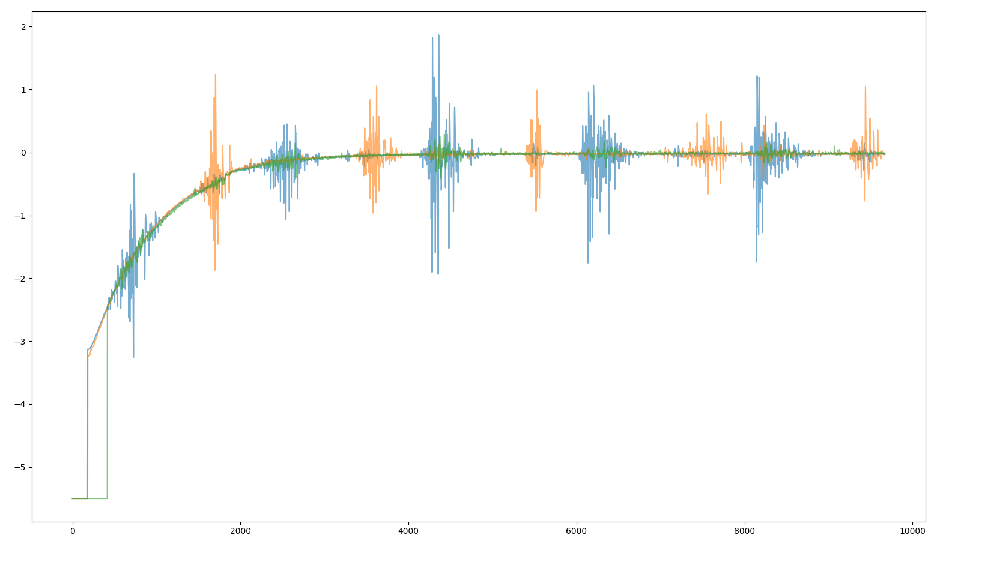

# single-pulse-emg  
To  install  dependencies use with Python 3.8.6rc1:  
`python -m pip install -r requirements.txt`  
&nbsp;  
### **emg_acquisition_multithread** contains class *DataLogger* that can trigger emg collection, log data, and store it.  
*DataLogger*   
- **setCollectionLen(self, nChan, fs, collection_time)**: preallocates numpy arrays to store EMG data based on number of channels, time, and sampling frequency.  
- **resetCollectionLen(self)**: clears the data queues and logs
- **getDataFromSensors(self)**: interacts with the TrignoBase to stream data from sensors to data queue while the data logs are not full. This is one of the threads that runs while multi-threading. This throws out data that equals -5.500083924620432 and starts collecting after. The data buffers start by being initialized to that for some odd reason.
- **logDataFromQueue(self)**: Gets data from the data queues and stores them in logs (preallocated numpy arrays). Sets self.pauseFlag to true when logs are full. This the other thread that runs. Eventually this could be the plotting/display thread.
- **threadManager(self)**: Starts and joins the threads when complete.
- **Connect_Callback(self)**: Validates the trigno base.
- **Scan_Callback(self)**: Finds and connects avaliable sensors. (Don't use pair for these sensors)  
- **Start_Callback(self,collection_time)**: Starts data streams from sensors and creates output destination. I call this in each loop of acquisition to reset the data buffers. I had an issue where the buffers were initialized to -5.500083924620432 when they were first started. An alternative workaround would be just to constantly stream the data. 
- **trig(self)**: starts multithreaded aquisition. I'm not sure if this is currently used.
- **Stop_Callback(self)**: Stops data streams with TrigBase class.
- **test_setup(self,collection_time)**: An alternate method for streaming called in *test_run_acquisition_multithreaded*. Seems like it actually collects some data first. Contains
- **test_run(self)**: sets collection length, starts data streams, and stops stream all in one function. Called by *test_run_acquisition_multithreaded*. 
- **getSampleModes(self,sensorIdx)**: returs a list of possible sample modes the sensor at sensorIdx can be in.  
- **getCurMode(self)**: pretty self-explanatory.
- **setSampleMode(self,setMode)**: sets sample modes of every sensor based on the string in setMode. I beleive I changed this a bit.  
&nbsp;  
&nbsp;  

### **run_acquisition_multithreaded**: Collects 0.3 s worth of data by starting data streams, triggering data collection, and stopping data collection based on *n_trials*.  
### **test_run_acquisition_multithreaded**: performs a similiar function as run_acquisition_multithreaded, but does so in a different way. I created this to get around the random rise in the signal shown below. 

&nbsp;
 ## AeroPy  
### **TrignoBase**: references the delsysAPI (sometimes referencing ths .dll with clr throws an error) and creates an instance of the TrignoBase.  
&nbsp;
## daq  
### **test**: right now is just messing around with controlling the daq.  
### **daq**: contains a class to interact with the daq.  
*mydaq*  
- **trig**: sends a pulse to the stimulator to direct a stim using *write_many_sample* member function.

## Device Manager
### Start_Callback: Starts Data Stream from Sensors.
### GetData: Retrives data from sensors and stores in an array.
### ProcessData: Calls GetData, places output array into a deque.
### getSampleModes(sensorIdx): gives list of available modes for that sensor.
### getCurModes: gets current mode of the sensor.
### setSampleMode: Sets sampling configuration for sensor, must be configured as follows ("EMG raw (4370 Hz), skin check (74 Hz), +/-11mv, 10-850Hz")
